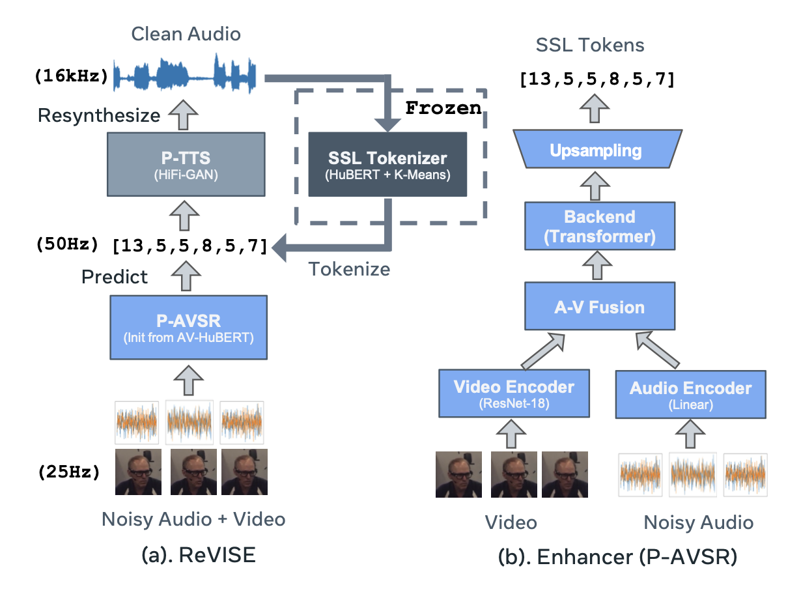

# AV-HuBERT (Audio-Visual Hidden Unit BERT) for ReVISE

## Introduction
AV-HuBERT is a self-supervised representation learning framework for audio-visual speech. It achieves state-of-the-art results in lip reading, ASR and audio-visual speech recognition on the LRS3 audio-visual speech benchmark.



## Pre-trained and fine-tuned models

Please find the checkpoints [here](http://facebookresearch.github.io/av_hubert)

## Installation
First, create a conda virtual environment and activate it:
```
conda create -n avhubert python=3.8 -y
conda activate avhubert
```
Then, clone this directory:
```
git clone https://github.com/facebookresearch/av_hubert.git
cd avhubert
git submodule init
git submodule update
```

Lastly, install Fairseq and the other packages:
```
pip install -r requirements.txt
cd fairseq
pip install --editable ./
```
## Load a pretrained model
```sh
$ cd avhubert
$ python
>>> import fairseq
>>> import hubert_pretraining, hubert
>>> ckpt_path = "/path/to/the/checkpoint.pt"
>>> models, cfg, task = fairseq.checkpoint_utils.load_model_ensemble_and_task([ckpt_path])
>>> model = models[0]
```

# Data preparation

### Installation
To preprocess, you need some additional packages:
```
pip install -r requirements.txt
```

## LRS3 Preprocessing

Download and decompress the [data](https://www.robots.ox.ac.uk/~vgg/data/lip_reading/lrs3.html). Assume the data directory is `${lrs3}`, which contains three folders (`pretrain,trainval,test`). Follow the steps below:

### 1. Data preparation
```sh
python lrs3_prepare.py --lrs3 ${lrs3} --ffmpeg /path/to/ffmpeg --rank ${rank} --nshard ${nshard} --step ${step}
```
Note: For your case change the --ffmpeg /path/to/ffmpeg (run which ffmpeg in your environment) , --rank, --nshard and --step are args fro distributed systems so only use them if you want to train it on distributed system.
--lrs3 arg will be the data directory of the dataset

This will generate a list of file-ids (`${lrs3}/file.list`) and corresponding text labels (`${lrs3}/label.list`). Specifically, it includes 4 steps, where `${step}` ranges from `1,2,3,4`. Step 1, split long utterances in LRS3 `pretraining` into shorter utterances, generate their time boundaries and labels. Step 2, trim videos and audios according to the new time boundary. Step 3, extracting audio for trainval and test split. Step 4, generate a list of file ids and corresponding text transcriptions.  `${nshard}` and `${rank}` are only used in step 2 and 3. This would shard all videos into `${nshard}` and processes `${rank}`-th shard, where rank is an integer in `[0,nshard-1]`. 

### 2. Detect facial landmark and crop mouth ROIs:
```sh
python detect_landmark.py --root ${lrs3} --landmark ${lrs3}/landmark --manifest ${lrs3}/file.list \
 --cnn_detector /path/to/dlib_cnn_detector --face_detector /path/to/dlib_landmark_predictor --ffmpeg /path/to/ffmpeg \
 --rank ${rank} --nshard ${nshard}
```
```sh
python align_mouth.py --video-direc ${lrs3} --landmark ${landmark_dir} --filename-path ${lrs3}/file.list \
 --save-direc ${lrs3}/video --mean-face /path/to/mean_face --ffmpeg /path/to/ffmpeg \
 --rank ${rank} --nshard ${nshard}
```

This generates mouth ROIs in `${lrs3}/video`. It shards all videos in `${lrs3}/file.list` into `${nshard}` and generate mouth ROI for `${rank}`-th shard , where rank is an integer in `[0,nshard-1]`. The face detection and landmark prediction are done using [dlib](https://github.com/davisking/dlib). The links to download `cnn_detector`, `face_detector`, `mean_face` can be found in the help message

### 3. Count number of frames per clip
```sh
python count_frames.py --root ${lrs3} --manifest ${lrs3}/file.list --nshard ${nshard} --rank ${rank}
```
This counts number of audio/video frames for `${rank}`-th shard and saves them in `${lrs3}/nframes.audio.${rank}` and `${lrs3}/nframes.video.${rank}` respectively. Merge shards by running:

```
for rank in $(seq 0 $((nshard - 1)));do cat ${lrs3}/nframes.audio.${rank}; done > ${lrs3}/nframes.audio
for rank in $(seq 0 $((nshard - 1)));do cat ${lrs3}/nframes.video.${rank}; done > ${lrs3}/nframes.video
```

If you are on slurm, the above commands (counting per shard + merging) can be combined by:
```sh
python count_frames_slurm.py --root ${lrs3} --manifest ${lrs3}/file.list --nshard ${nshard} \
 --slurm_partition ${slurm_partition}
```
It has dependency on [submitit](https://github.com/facebookincubator/submitit) and will directly  generate `${lrs3}/nframes.audio` and `${lrs3}/nframes.video`.

### 4. Set up data directory
```sh
python lrs3_manifest.py --lrs3 ${lrs3} --manifest ${lrs3}/file.list \
 --valid-ids /path/to/valid --vocab-size ${vocab_size}
```

This sets up data directory of trainval-only (~30h training data) and pretrain+trainval (~433h training data). It will first make a tokenizer based on sentencepiece model and set up target directory containing `${train|valid|test}.{tsv|wrd}`. `*.tsv` are manifest files and `*.wrd` are text labels.  `/path/to/valid` contains held-out clip ids used as validation set. The one used in our experiments can be found [here](data/lrs3-valid.id). 


## VoxCeleb2 Preprocessing

Download and decompress the [data](https://www.robots.ox.ac.uk/~vgg/data/voxceleb/vox2.html). Assume the data directory is `${vox}`, which contains two folders (`dev,test`). Follow the steps below:

### 1. Data preparation
```sh
python vox_prepare.py --root ${vox} --ffmpeg /path/to/ffmpeg --rank ${rank} --nshard ${nshard} --step ${step}
```
This will generate a list of file-ids (`${vox}/file.list`, by step 1) and extract audio wavform from original videos (by step 2). `${step}` ranges from `1,2`.   `${nshard}` and `${rank}` are only used in step 2. This would shard all videos into `${nshard}` and extract audio for `${rank}`-th shard, where rank is an integer in `[0,nshard-1]`. 

### 2. Detect facial landmark and crop mouth ROIs:
```sh
python detect_landmark.py --root ${vox} --landmark ${vox}/landmark --manifest ${vox}/file.list \
 --cnn_detector /path/to/dlib_cnn_detector --face_detector /path/to/dlib_landmark_predictor --ffmpeg /path/to/ffmpeg \
 --rank ${rank} --nshard ${nshard}
```
```sh
python align_mouth.py --video-direc ${vox} --landmark ${landmark_dir} --filename-path ${vox}/file.list \
 --save-direc ${vox}/video --mean-face /path/to/mean_face --ffmpeg /path/to/ffmpeg \
 --rank ${rank} --nshard ${nshard}
```

This generates mouth ROIs in `${vox}/video`, similar to LRS3 data preparation.

### 3. Count number of frames per clip
```sh
python count_frames.py --root ${vox} --manifest ${vox}/file.list --nshard ${nshard} --rank ${rank}
```
This counts number of audio/video frames for `${rank}`-th shard and saves them in `${vox}/nframes.audio.${rank}` and `${vox}/nframes.video.${rank}` respectively, similar to LRS3 data preparation. Merge shards by running:

```
for rank in $(seq 0 $((nshard - 1)));do cat ${vox}/nframes.audio.${rank}; done > ${vox}/nframes.audio
for rank in $(seq 0 $((nshard - 1)));do cat ${vox}/nframes.video.${rank}; done > ${vox}/nframes.video
```

If you are on slurm, the above commands (counting per shard + merging) can be combined by:
```sh
python count_frames_slurm.py --root ${vox} --manifest ${vox}/file.list --nshard ${nshard} \
 --slurm_partition ${slurm_partition}
```
It has dependency on [submitit](https://github.com/facebookincubator/submitit) and will directly  generate `${vox}/nframes.audio` and `${vox}/nframes.video`, similar to LRS3 data preparation.

### 4. Set up data directory
```sh
python vox_manifest.py --vox ${vox} --manifest ${vox}/file.list \
 --en-ids /path/to/en
```

This sets up data directory of the whole VoxCeleb2 and its English-only subset.  `/path/to/en` contains English-only clip ids. The one used in our experiments can be found [here](data/vox-en.id.gz). 

## Audio Noise Preparation (Optional)
If you want to test your model under noisy setting, you should prepare audio noise data. First download and decompress the [MUSAN](https://www.openslr.org/17/) corpus. Assume the data directory is `${musan}`, which contains the following folders `{music,speech,noise}`.

### 1. MUSAN data preparation
```sh
python musan_prepare.py --musan ${musan} --nshard ${nshard}  --slurm_partition ${slurm_partition}
```
This will: (1) split raw audios into 10-second clips, (2) generate babble noise from MUSAN speech audio, (3) count number of frames per clip. The whole data will be sharded into `${nshard}` parts and each job processes one part. It runs on Slurm and has dependency on [submitit](https://github.com/facebookincubator/submitit)


### 2. LRS3 audio noise preparation
```sh
python lrs3_noise.py --lrs3 ${lrs3}
```
It will generate LRS3 babble and speech noise including their manifest files, which are stored in `${lrs3}/noise/{babble,speech}`. `${lrs3}` is the LRS3 data directory. Make sure you already finished setting up LRS3 before running the command.

The following command generates babble noise from LRS3 training set.
```sh
python mix_babble.py --lrs3 ${lrs3}
```

### 3. Set up noise directory
```sh
python noise_manifest.py --lrs3 ${lrs3}  --musan ${musan}
```
It will make manifest (tsv) files for MUSAN babble, music and noise in `${musan}/tsv/{babble,music,noise}`, as well as a combined manifest in `${musan}/tsv/all` including MUSAN babble, music, noise and LRS3 speech. 

# AV-HuBERT Label Preparation

This folder contains scripts for preparing AV-HUBERT labels from tsv files, the
steps are:
1. feature extraction
2. k-means clustering
3. k-means application

## Installation
To prepare labels, you need some additional packages:
```
pip install -r requirements.txt
```

## Data preparation

`*.tsv` files contains a list of audio, where each line is the root, and
following lines are the subpath and number of frames of each video and audio separated by `tab`:
```
<root-dir>
<id-1> <video-path-1> <audio-path-1> <video-number-frames-1> <audio-number-frames-1>
<id-2> <video-path-2> <audio-path-2> <video-number-frames-2> <audio-number-frames-2>
...
```
See [here](../preparation/) for data preparation for LRS3 and VoxCeleb2. 

## Feature extraction

### MFCC feature
Suppose the tsv file is at `${tsv_dir}/${split}.tsv`. To extract 39-D
mfcc+delta+ddelta features for the 1st iteration AV-HuBERT training, run:
```sh
python dump_mfcc_feature.py ${tsv_dir} ${split} ${nshard} ${rank} ${feat_dir}
```
This would shard the tsv file into `${nshard}` and extract features for the
`${rank}`-th shard, where rank is an integer in `[0, nshard-1]`. Features would
be saved at `${feat_dir}/${split}_${rank}_${nshard}.{npy,len}`.


### AV-HuBERT feature
To extract features from the `${layer}`-th transformer layer of a trained
AV-HuBERT model saved at `${ckpt_path}`, run:
```sh
python dump_hubert_feature.py ${tsv_dir} ${split} ${ckpt_path} ${layer} ${nshard} ${rank} ${feat_dir} --user_dir `pwd`/../
```
Features would also be saved at `${feat_dir}/${split}_${rank}_${nshard}.{npy,len}`.

- if out-of-memory, decrease the chunk size with `--max_chunk`


## K-means clustering
To fit a k-means model with `${n_clusters}` clusters on 10% of the `${split}` data, run
```sh
python learn_kmeans.py ${feat_dir} ${split} ${nshard} ${km_path} ${n_cluster} --percent 0.1
```
This saves the k-means model to `${km_path}`.

- set `--precent -1` to use all data
- more kmeans options can be found with `-h` flag


## K-means application
To apply a trained k-means model `${km_path}` to obtain labels for `${split}`, run
```sh
python dump_km_label.py ${feat_dir} ${split} ${km_path} ${nshard} ${rank} ${lab_dir}
```
This would extract labels for the `${rank}`-th shard out of `${nshard}` shards
and dump them to `${lab_dir}/${split}_${rank}_${shard}.km`


Finally, merge shards for `${split}` by running
```sh
for rank in $(seq 0 $((nshard - 1))); do
  cat $lab_dir/${split}_${rank}_${nshard}.km
done > $lab_dir/${split}.km
```
and create a dictionary of cluster indexes by running
```sh
for i in $(seq 1 $((n_cluster-1)));do 
    echo $i 10000
done > $lab_dir/dict.{mfcc,km}.txt
```


## Clustering on slurm
If you are on slurm, you can combine the above steps (feature extraction + K-means clustering + K-means application) by:

- MFCC feature cluster:
```sh
python submit_cluster.py --tsv ${tsv_dir} --output ${lab_dir} --ncluster ${n_cluster} \
  --nshard ${nshard} --mfcc --percent 0.1
```

- AV-HuBERT feature cluster:
```sh
python submit_cluster.py --tsv ${tsv_dir} --output ${lab_dir} --ckpt ${ckpt_path} --nlayer ${layer} \
  --ncluster ${n_cluster} --nshard ${nshard} --percent 0.1
```

This would  dump labels to `${lab_dir}/{train,valid}.km`.

# Inference

The inference pipeline is made simple an quick:

```sh
python adams_apple.py
```
Note: Make sure that ckpt_model, mouth_roi_path and user_dir variables are modified according to your system. We have simply a placeholder path locations.

Download the sample test video:
```sh
!mkdir -p /content/data/misc/
!wget http://dlib.net/files/shape_predictor_68_face_landmarks.dat.bz2 -O /content/data/misc/shape_predictor_68_face_landmarks.dat.bz2
!bzip2 -d /content/data/misc/shape_predictor_68_face_landmarks.dat.bz2
!wget --content-disposition https://github.com/mpc001/Lipreading_using_Temporal_Convolutional_Networks/raw/master/preprocessing/20words_mean_face.npy -O /content/data/misc/20words_mean_face.npy

```
Download the video from the internet
```sh
!wget --content-disposition https://dl.fbaipublicfiles.com/avhubert/demo/avhubert_demo_video_8s.mp4 -O /content/data/clip.mp4
```

# Finetunning

Suppose `{train,valid}.tsv` are saved at `/path/to/data`, `{train,valid}.wrd`
are saved at `/path/to/labels`, the configuration file is saved at `/path/to/conf/conf-name`.

To fine-tune a pre-trained HuBERT model at `/path/to/checkpoint`, run:
```sh
$ cd avhubert
$ fairseq-hydra-train --config-dir /path/to/conf/ --config-name conf-name \
  task.data=/path/to/data task.label_dir=/path/to/label \
  task.tokenizer_bpe_model=/path/to/tokenizer model.w2v_path=/path/to/checkpoint \
  hydra.run.dir=/path/to/experiment/finetune/ common.user_dir=`pwd`